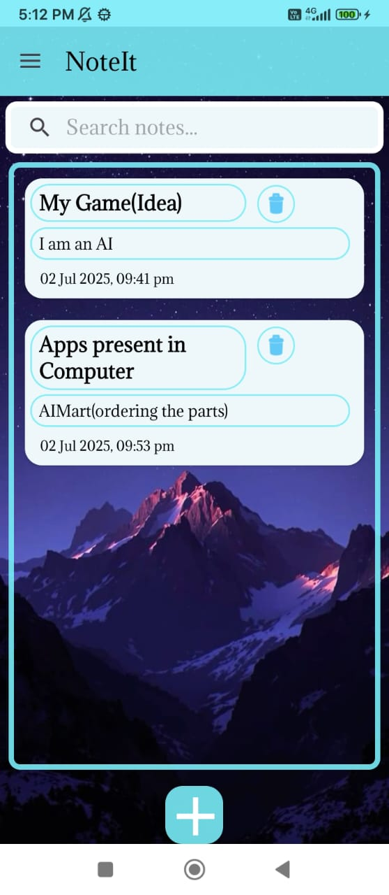
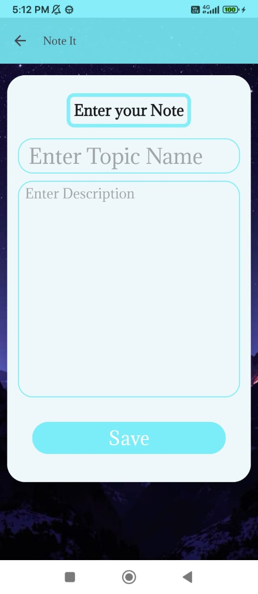
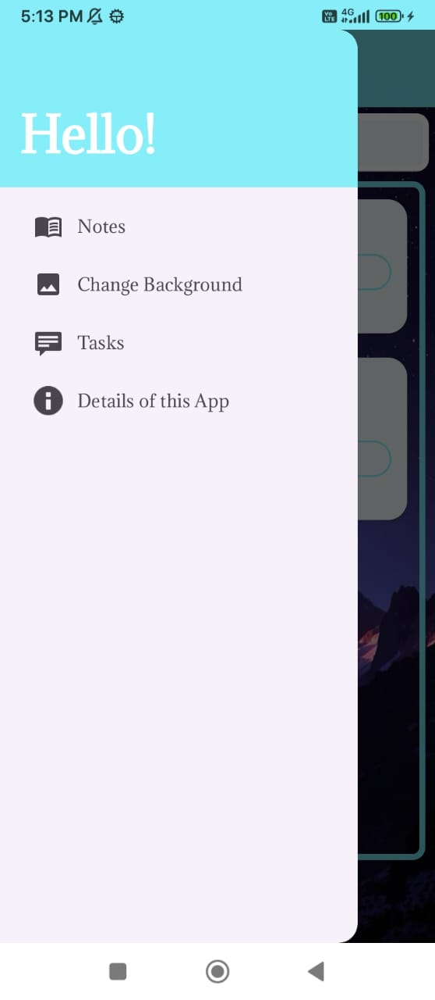
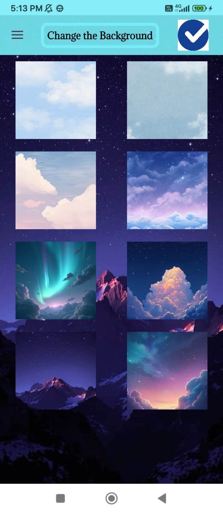
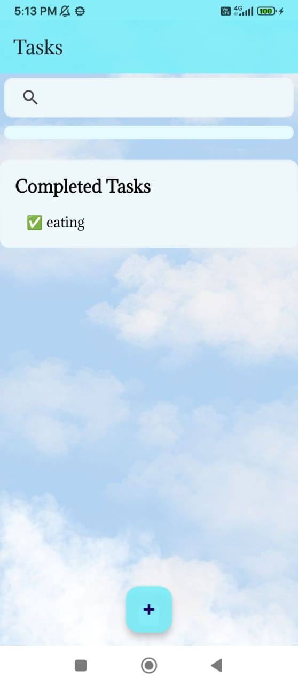
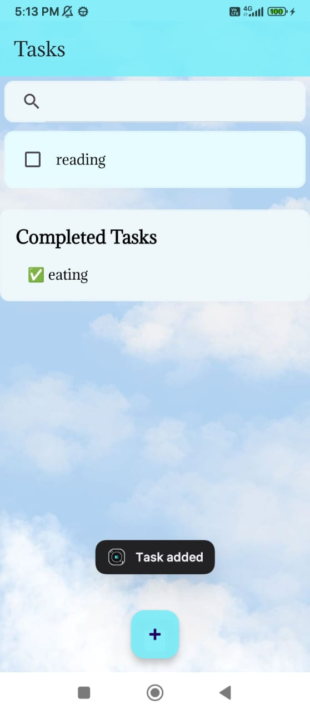
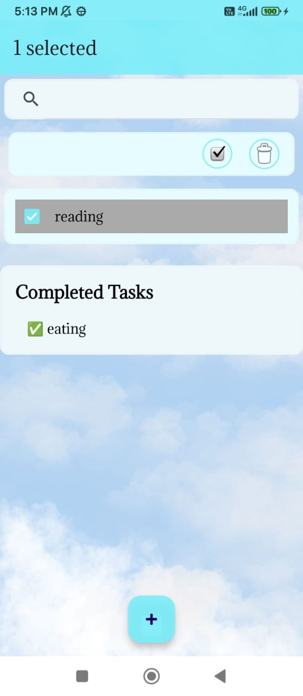

# 📝 NoteIt - Notes + Tasks App

> The ultimate hybrid app to **take notes**, **manage tasks**, and **customize your workspace** – all in one smooth experience.

---

## 📌 What is NoteIt?

**NoteIt** is a modern mobile application that combines the simplicity of a **notes app** with the functionality of a **to-do list/task manager**. With NoteIt, you can write quick notes, organize your daily tasks, and even personalize your background for a fresh look every time you open it.

---

## 🚀 Features

- 🖊️ Create and edit notes easily
- ✅ Add checkable to-do tasks
- 🧽 Delete notes and tasks
- 🎨 Change background themes to your liking
- 📂 Lightweight and clean UI/UX
- 🔄 Real-time updates and syncing (optional with backend)
- 🔒 Optionally add biometric/password lock (in future updates)

---

## 🧭 Navigation

- **Home Screen:** View your notes & tasks
- **Note Editor:** Edit text, title, and set background
- **Task Manager:** Check off completed tasks

---

## 🖼️ App Screenshots

Here’s what NoteIt looks like in action 👇

---

---

---

---

---

---

---
